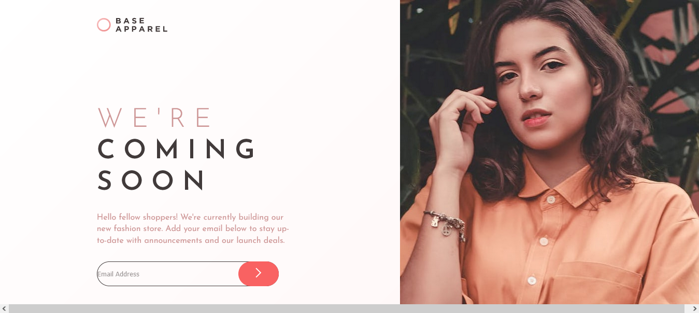
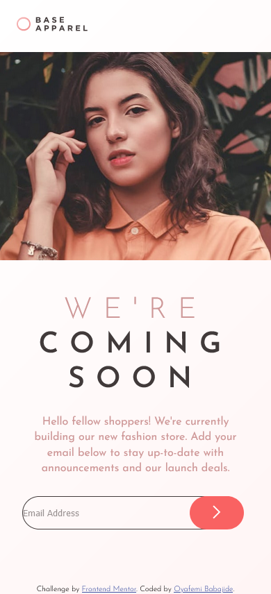

# Frontend Mentor - Base Apparel coming soon page solution

This is a solution to the [Base Apparel coming soon page challenge on Frontend Mentor](https://www.frontendmentor.io/challenges/base-apparel-coming-soon-page-5d46b47f8db8a7063f9331a0). Frontend Mentor challenges help you improve your coding skills by building realistic projects.

## Table of contents

- [Overview](#overview)
  - [The challenge](#the-challenge)
  - [Screenshot](#screenshot)
  - [Links](#links)
  - [Built with](#built-with)
- [Author](#author)

## Overview

### The challenge

Users should be able to:

- View the optimal layout for the site depending on their device's screen size
- See hover states for all interactive elements on the page
- Receive an error message when the `form` is submitted if:
  - The `input` field is empty
  - The email address is not formatted correctly

### Screenshot

### Links

- Solution URL: [Add solution URL here](https://github.com/Babajide777/base-apparel-coming-soon)
- Live Site URL: [Add live site URL here](https://babajide777.github.io/base-apparel-coming-soon/)

### Built with

- Semantic HTML5 markup
- CSS custom properties
- Flexbox
- CSS Grid
- Mobile-first workflow
- SCSS(SASS)

## Author

- Website - [Oyafemi Babajide](https://babajide-portfolio.netlify.app/)
- Frontend Mentor - [Babajide777](https://www.frontendmentor.io/profile/Babajide777)
- Twitter - [@jid_Boss](https://www.twitter.com/jid_Boss)
